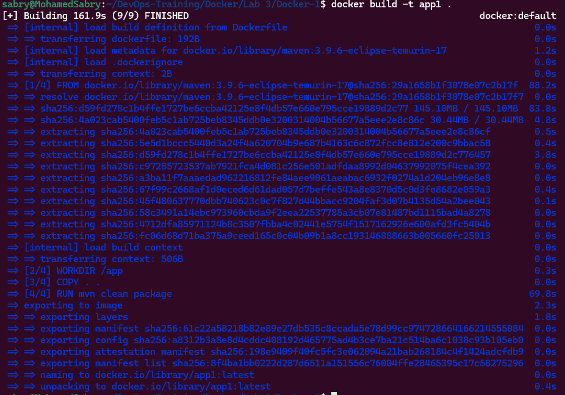
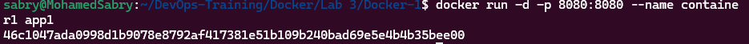
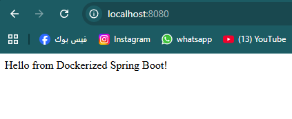

# Lab 3: Run Java Spring Boot App in a Docker Container

## Objective
The goal of this lab is to containerize a Java Spring Boot application using Docker and Maven, then build, run, test, and clean up the container.

## Application Source
The Spring Boot application is cloned from:
https://github.com/Ibrahim-Adel15/Docker-1.git

## Tools & Technologies
- Docker
- Maven
- Java 17
- Spring Boot
- Git
- WSL (Ubuntu)

## Project Structure
Docker/
└── Lab 3/
    ├── Docker-1/
    │   ├── Dockerfile
    │   ├── pom.xml
    │   └── src/
    └── README.md

# Dockerfile
```bash
FROM maven:3.9.6-eclipse-temurin-17
WORKDIR /app
COPY . .
RUN mvn clean package
EXPOSE 8080
CMD ["java", "-jar", "target/demo-0.0.1-SNAPSHOT.jar"]
```

## Steps
## 1. Clone the application

```bash
git clone https://github.com/Ibrahim-Adel15/Docker-1.git
```

## 2. Build Docker Image

```bash
docker build -t app1 .
```


## 3. Run the Container

```bash
docker run -d -p 8080:8080 --name container1 app1
```


## 4. Test the Application

```bash
curl http://localhost:8080
or open http://localhost:8080
```


## 5. Stop and Remove the Container

```bash
docker stop container1
docker rm container1
```

## Result
The Spring Boot application runs successfully inside a Docker container and is accessible on port 8080.

