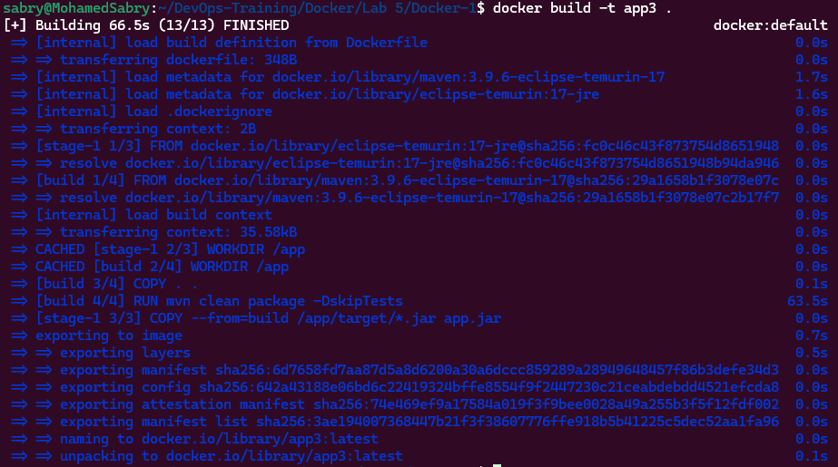
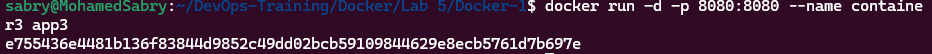
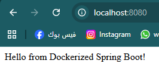

# Lab 5 – Multi-Stage Docker Build
## Objective
The goal of this lab is to build a Java Maven application using a multi-stage Docker build in order to
reduce image size and follow Docker best practices.
## Application Source
https://github.com/Ibrahim-Adel15/Docker-1.git
## Steps
### 1. Clone the repository:

```bash
git clone https://github.com/Ibrahim-Adel15/Docker-1.git
```

### 2. Create a multi-stage Dockerfile using Maven for build and Java runtime for execution.

```bash
# -------- First Stage: Build --------
FROM maven:3.9.6-eclipse-temurin-17 AS build
WORKDIR /app
COPY . .
RUN mvn clean package -DskipTests

# -------- Second Stage: Run --------
FROM eclipse-temurin:17-jre
WORKDIR /app
COPY --from=build /app/target/*.jar app.jar
EXPOSE 8080
CMD ["java", "-jar", "app.jar"]
```

### 3. Build the Docker image:

```bash
docker build -t app3 .
```

### 4. Run the container:

```bash
docker run -d -p 8080:8080 --name container3 app3
```

### 5. Test the application using a browser or curl:

```bash
http://localhost:8080
```


## Notes
- Multi-stage builds reduce final image size
- Maven is only used during the build stage
- The final image contains only the JAR and Java runtime
