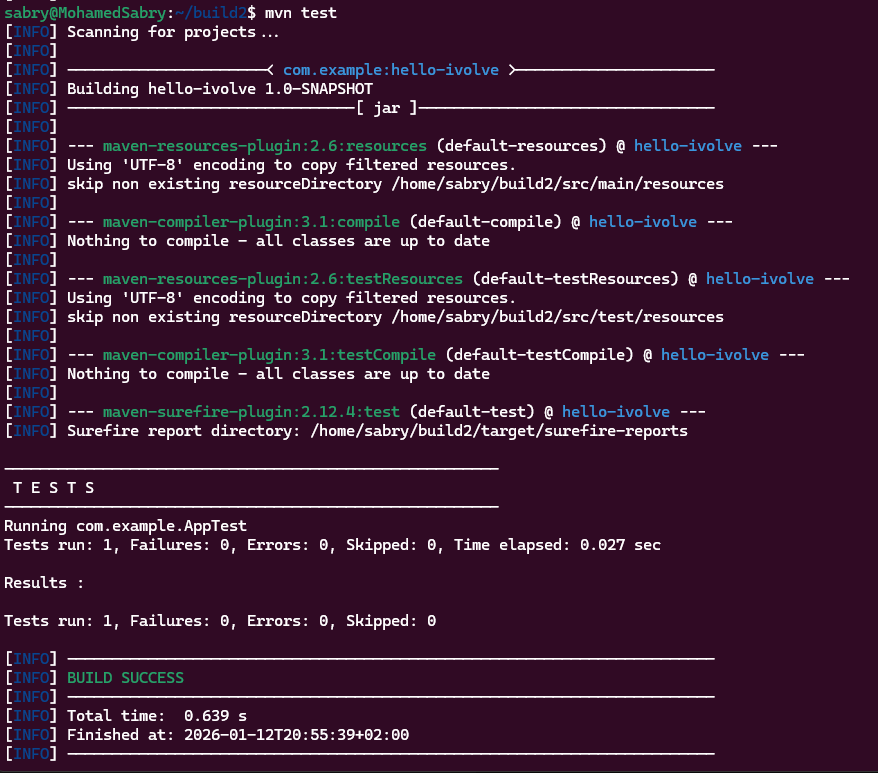
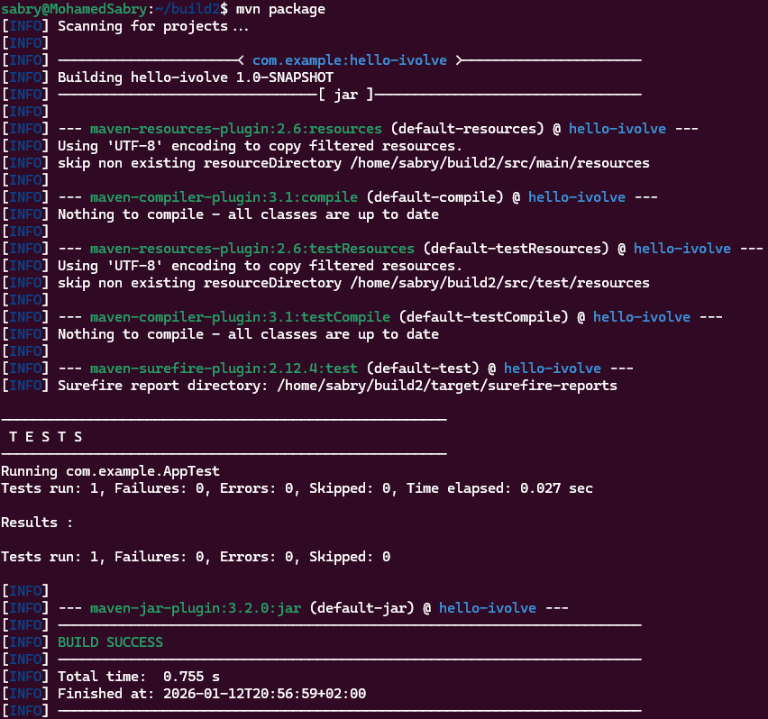
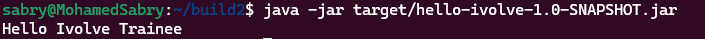

# Build Tools with Maven

This repository demonstrates a complete **Maven workflow** for building and running a Java application. The steps include cloning the source code, running unit tests, packaging the application, and running it.

---

## Step 1: Clone the Repository

Clone the source code from GitHub:

```bash
git clone https://github.com/Ibrahim-Adel15/build2.git
cd build2
```


---

## Step 2: Run Unit Test

Execute the unit tests for the project:

```bash
mvn test
```



---

## Step 3: Package the Application

Assemble the project and create the JAR file:

```bash
mvn package
```



---

## Step 4: Run the Application

Execute the application:

```bash
java -jar target/hello-ivolve-1.0-SNAPSHOT.jar
```


